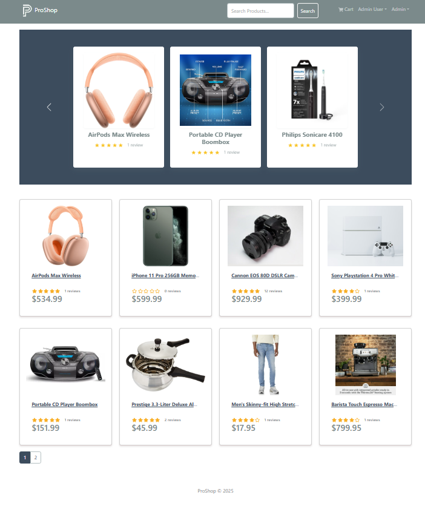
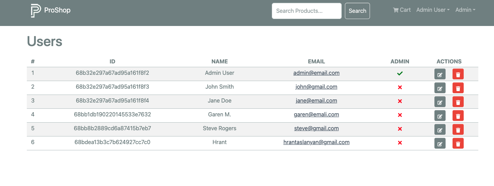
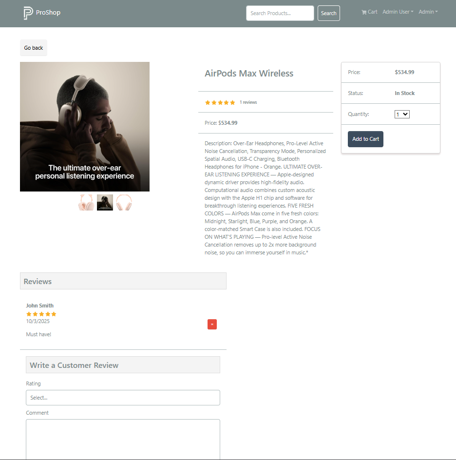
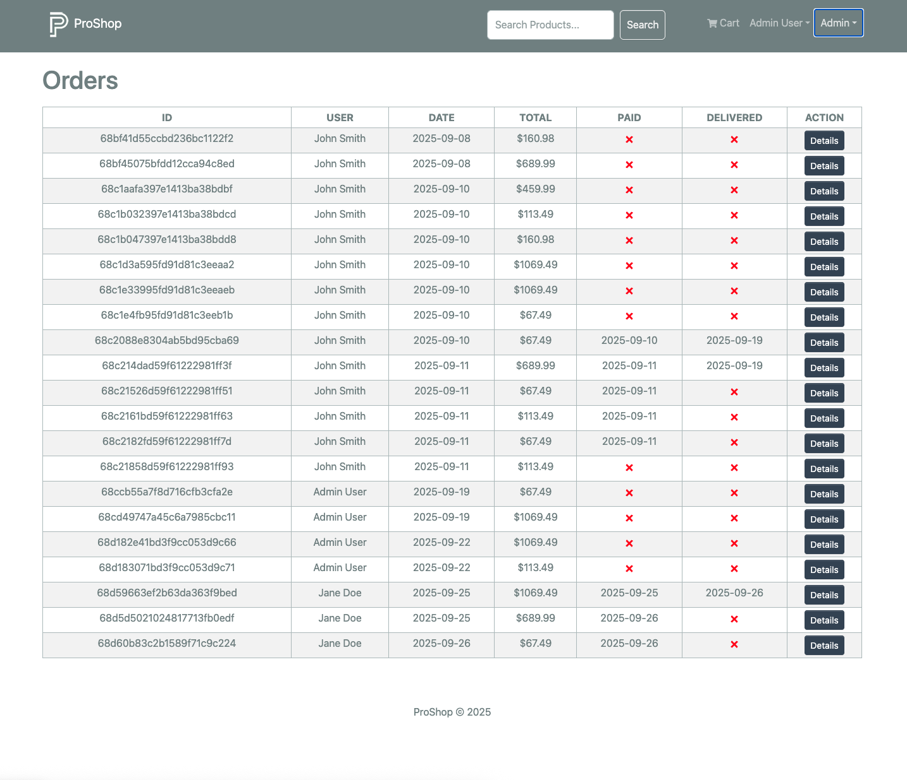

# 🛒 ProShop Demo  
A full-stack eCommerce application built **from scratch** with the **MERN stack** (MongoDB, Express, React, Node.js).  

## 🚀 Features  
- User authentication & authorization (JWT)  
- Admin dashboard for managing products, users, and orders  
- Product search, pagination, and reviews  
- Shopping cart & checkout process  
- PayPal & credit card payments  
- Product image upload

##   🚀 Improvements!    
- Cloudinary cloud-hosted image uploads for new products (no local backend storage)  
- Deployment-ready (tested on Render)  

## 🛠️ Custom Modifications  
- Carousel now dynamically updates with newly uploaded images  
- Deletion of product images works for both old and new images  
- Null-safe handling of images to prevent frontend crashes  
- Frontend fetches images directly from Cloudinary  

## 🛠️ Tech Stack  
- **Frontend:** React 18/19, Redux Toolkit, React Router, React Bootstrap  
- **Backend:** Node.js, Express, MongoDB, Mongoose  
- **Payments:** PayPal API  
- **Deployment:** Render (backend + frontend), MongoDB Atlas (DB)  

## 📸 Screenshots  
### Home Page  
  

### Users Page  
  

### Cart  
  

### Admin Dashboard  
  

## 🔑 Environment Variables  
Create a `.env` file in the backend root:  
```bash
NODE_ENV=production
PORT=5000
MONGO_URI=your_mongo_uri
JWT_SECRET=your_secret
PAYPAL_CLIENT_ID=your_paypal_id
PAYPAL_API_URL=https://api-m.sandbox.paypal.com
```
🚦 Quick Start
```bash
# Clone repo
git clone https://github.com/yourusername/proshop-demo.git
cd proshop-demo

# Install dependencies
npm install
cd frontend && npm install

# Run dev mode (concurrently frontend & backend)
npm run dev

# Build frontend
npm run build

# Run production
npm run server
```
✅ Lessons Learned
	•	Built this project from the ground up, step by step, without boilerplate code
	•	Gained confidence in full-stack development workflow
	•	Debugging React/Redux state issues (cart reset on logout, refetch positioning, etc.)
	•	Handling dependency conflicts (React 19 compatibility)
	•	SPA routing fixes for production refresh
	•	Securing routes with middleware (protect, admin)
	•	Deployment flow with Render

🙌 Credits
	•	Course by Brad Traversy
	•	Personal fixes & enhancements by Karen Martirosyan